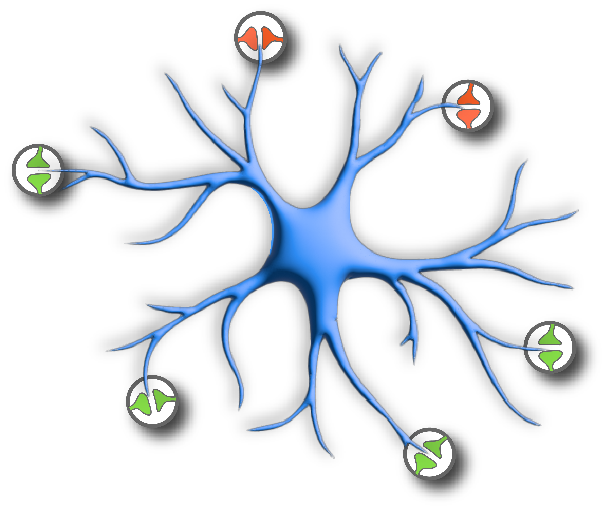

<div align="center">
    
</div>


This repository contains code to implement neuron-astrocyte associative memory networks, as described in [Kozachkov, Slotine & Krotov (2023)](https://arxiv.org/abs/2311.08135). 

To begin, please see the [tutorial notebook](notebooks/Basic-Neuron-Astrocyte-Associative-Memory-Network-Tutorial.ipynb) which illustrates the basic functionality of neuron-astrocyte associative memory networks.


If you wish to cite this paper in your work, please use the following BibTeX entry:

```bibtex
@article{kozachkov2023neuron,
  title={Neuron-Astrocyte Associative Memory},
  author={Kozachkov, Leo and Slotine, Jean-Jacques and Krotov, Dmitry},
  journal={arXiv preprint arXiv:2311.08135},
  year={2023}
}
```
